<p align="center"></p>

<h1 align="center">T4B - Tootsy for Business</h1>

<p align="center">
  A desktop AI assistant for Windows, macOS and Linux.<br>
  <a href="https://github.com/rbughao/t4b/releases/latest"><b>Download</b></a> ·
  <a href="#part-1--install-and-use">Install and use</a> ·
  <a href="#part-2--20-ways-teams-use-t4b">20 use cases</a>
</p>

T4B works with AI models running on your own computer, on your company's servers, or with cloud services such as OpenAI and Anthropic. It can read your documents, search the web, and use tools, and it asks you before it changes anything.

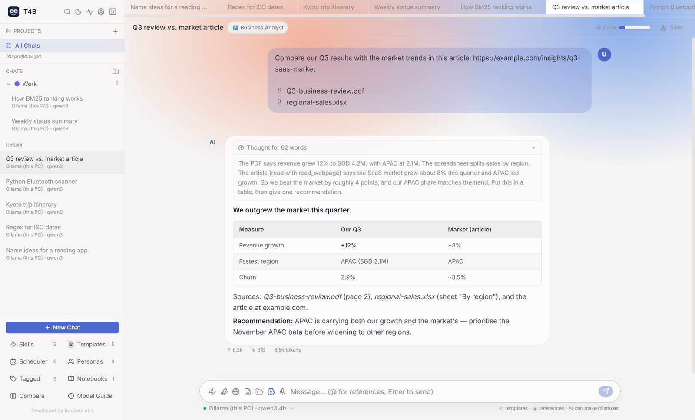

## Download

Get the latest installer from the [Releases page](https://github.com/rbughao/t4b/releases/latest).

| System | File |
|---|---|
| Windows 10/11 (64-bit) | `T4B-Tootsy-for-Business-Setup-<version>.exe` |
| macOS, Apple silicon | `T4B-Tootsy-for-Business-<version>-mac-arm64.dmg` |
| macOS, Intel | `T4B-Tootsy-for-Business-<version>-mac-x64.dmg` |
| Linux (64-bit) | `T4B-Tootsy-for-Business-<version>-linux-x86_64.AppImage` or `…-linux-x64.tar.gz` |

The installers contain no API keys or connector credentials; you add your own after installing.

## What's new in 0.2.3

- **Long chats keep their memory.** When a chat gets longer than the model can read at once, T4B summarizes the older messages instead of forgetting them. [More](#long-chats)
- **Notebooks open as tiles**, so you can see all your notebooks, their sources and status at a glance. [More](#5-everyday-features)
- **Big tool results are trimmed to fit**, so the model never loses its instructions or your question.
- **Automatic updates** from this page on Windows and the Linux AppImage. [More](#2-install)
- **Model picker under the chat box**, and a hardened app: sandboxed windows, links open in your browser, remote images in replies aren't loaded.

---

# Part 1 — Install and use

**Contents**
1. [What you need](#1-what-you-need)
2. [Install](#2-install)
3. [Connect an AI model](#3-connect-an-ai-model)
4. [Your first chat](#4-your-first-chat)
5. [Everyday features](#5-everyday-features)
6. [Tools: what T4B can do for you](#6-tools-what-t4b-can-do-for-you)
7. [Safety and privacy](#7-safety-and-privacy)
8. [Settings at a glance](#8-settings-at-a-glance)
9. [Troubleshooting](#9-troubleshooting)

## 1. What you need

- A Windows 10/11 (64-bit), macOS 11 or later (Apple silicon or Intel), or 64-bit Linux computer with about 1 GB of free disk space.
- At least one AI model. You have three options:

  | Option | Best for |
  |---|---|
  | **Local**: Ollama or LM Studio on your computer | Private data; it's free and works offline |
  | **Company server**: any OpenAI-compatible server on your network | Teams sharing one powerful machine |
  | **Cloud**: OpenAI, Anthropic, Google Gemini, OpenRouter, Amazon Bedrock and more | The most capable models; needs an API key and is paid per use |

  Your IT team may already have one of these set up for you.

## 2. Install

Download the installer for your system from the [Releases page](https://github.com/rbughao/t4b/releases/latest), or get it from your IT team.

**Windows** (`T4B-Tootsy-for-Business-Setup-<version>.exe`)
1. Double-click the installer. Windows may show **"Windows protected your PC"**, because the installer isn't code-signed yet. If the file came from a source you trust, click **More info → Run anyway**.
2. Choose an install folder (the default is fine) and click **Install**.
3. Open **T4B - Tootsy for Business** from the Start menu or the desktop shortcut.

**macOS** (`…-mac-arm64.dmg` for Apple-silicon Macs, `…-mac-x64.dmg` for Intel Macs)
1. Open the `.dmg` and drag **T4B - Tootsy for Business** into **Applications**.
2. The app isn't notarized by Apple yet. The first time, **right-click (or Control-click) the app → Open → Open**.
3. If macOS says the app "is damaged and can't be opened", that's the download quarantine flag on an unsigned app. Run this once in Terminal, then open the app again:
   ```bash
   xattr -cr "/Applications/T4B - Tootsy for Business.app"
   ```

**Linux** (`…-linux-x86_64.AppImage`, or `…-linux-x64.tar.gz`)
1. Make the AppImage executable and run it:
   ```bash
   chmod +x T4B-Tootsy-for-Business-*.AppImage
   ./T4B-Tootsy-for-Business-*.AppImage
   ```
2. Or unpack the `.tar.gz` anywhere and run `t4b` inside it.
3. Some distributions need FUSE for AppImages (for example `sudo apt install libfuse2` on Ubuntu 22.04 and later).

On macOS and Linux, run-command tools use the system shell (`/bin/sh`) instead of PowerShell.

**Upgrading.** Install the new version over your existing copy. Your chats, notebooks, settings and saved keys carry over.

**Updates.** From version 0.2.3, T4B checks the [Releases page](https://github.com/rbughao/t4b/releases) for new versions in the background:

| Installer | Updates |
|---|---|
| Windows `.exe` | Automatic. The update downloads in the background; click **Settings → General → Updates → Restart and update**, or it installs the next time you quit |
| Linux AppImage | Automatic, the same way |
| macOS, Linux `.tar.gz` | Download each new version from the Releases page (automatic updates on macOS need a signed app) |

If you have version 0.2.2 or earlier, install 0.2.3 by hand once; later versions then arrive automatically.

## 3. Connect an AI model

A **connection** is where your models come from. On first launch T4B shows **Connect your first model**:

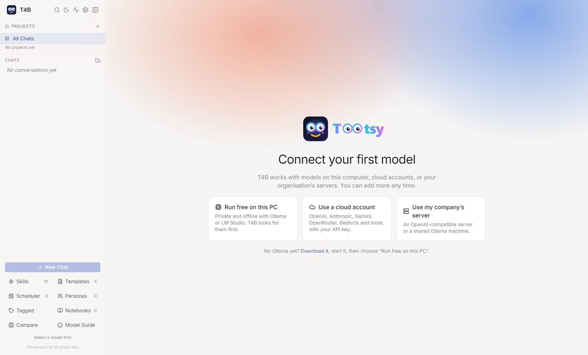

Later, use **Settings → Connections → Add connection**, or **Add connection** at the bottom of the model picker. You can add as many connections as you like, including several of the same kind (for example a work and a personal OpenAI account).

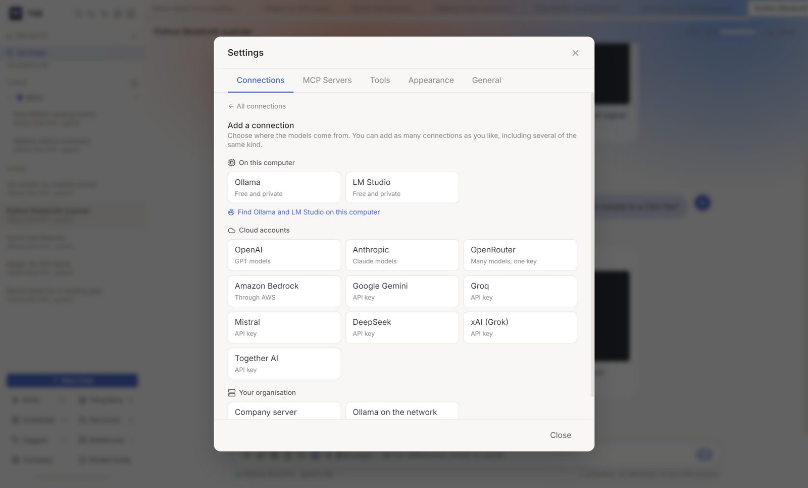

Each connection is tested before you save it: you see the models it found and choose which ones appear in the picker.

### Local models with Ollama

1. Install Ollama from [ollama.com](https://ollama.com) and start it.
2. Download a model. In a terminal (PowerShell on Windows), run for example:
   ```bash
   ollama pull qwen3:4b
   ```
   Small models (1–4B parameters) are fast. Larger ones (8B and up) give better answers but need a good GPU or plenty of RAM.
3. In T4B, choose **Run free on this PC** (or **Find on this computer** in Settings → Connections). T4B finds Ollama and adds it, and your models appear in the model picker under the chat box. A running Ollama or LM Studio is usually found automatically when T4B starts.

### Cloud models

1. Get an API key from the service: OpenAI, Anthropic, OpenRouter, Google Gemini, Groq, Mistral, DeepSeek, xAI or Together AI, or AWS credentials for Bedrock.
2. **Add connection → Cloud accounts**, choose the service and paste the key. For the ready-made services the address is filled in for you. Keys are stored encrypted on your computer.
3. Click **Test connection**, choose which models to show, then **Add connection**. Pick a model from the model picker under the chat box.

### A company server

**Add connection → Your organisation → Company server**, then enter the server's address (for example `http://10.0.0.5:8000/v1`) and its key if it needs one. For a shared Ollama machine choose **Ollama on the network**. If the server can't list its models, tick *The server can't list its models* and type them in.

IT teams can set this up once and use **Export (without keys)**; colleagues use **Import** and add their own keys.

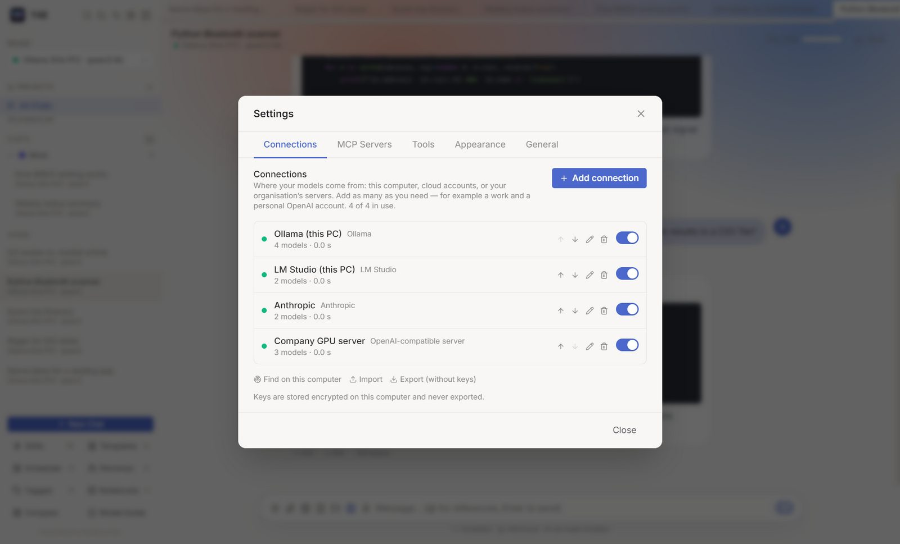

> **Which should I use?** Use a local model or a company server for confidential material. Use a cloud model when you need the best reasoning and the data is fine to send to that provider. The **Model Guide** in the sidebar explains the strengths of each model.

## 4. Your first chat

1. Pick a model with the **model picker under the chat box** (or on the start screen when no chat is open). Models are grouped by connection; star your favourites and use the pin to make one the default for new chats. You can switch a chat's model at any time the same way.
2. Click **New Chat**.
3. Type your question and press **Enter**. Use **Shift+Enter** for a new line.

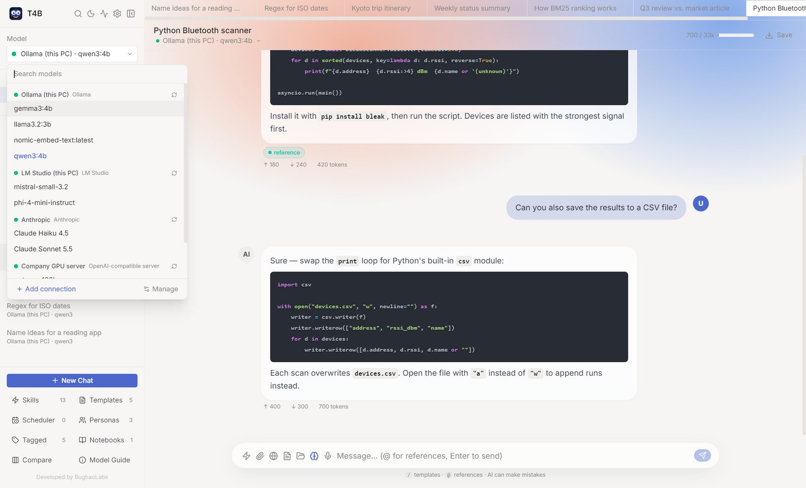

Under the message box:

| Button | What it does |
|---|---|
| ⚡ | Insert a **Skill**, a ready-made task such as *Summarise* or *Translate* |
| 📎 | Attach files: PDF, Word, Excel, PowerPoint, emails, images and more |
| 🌐 | Add a web page by its link |
| 📄 | Insert a prompt template (or type `/`) |
| 📁 | Give T4B access to a folder, so it can read, search and create files there |
| 🧠 | Turn the model's visible "thinking" on or off for this chat (off is faster) |
| 🔧 | Tool mode: **Auto** (only relevant tools), **On** (all tools) or **Off** |
| 🎤 | Speak your question instead of typing it |

Each reply shows the tokens used and, for cloud models, its cost. The bar at the top right shows how much of the model's memory (its context window) the chat is using.

### Long chats

Every model can only read so much at once. When a chat gets longer than that, T4B has the chat's own model write a summary of the older messages and sends the summary instead, so the model keeps your goals, decisions, numbers and file names rather than forgetting the start of the conversation.

- Your messages stay in the chat. An **Earlier messages summarized** divider marks where the summary begins; click it to see what the model remembers.
- Click the fold icon next to the memory bar to **compact a chat now**, for example before a long follow-up.
- The summary is made by the same connection as the chat, so nothing goes to another provider. With cloud models it costs a little, like any request.
- Large tool results (a big file, long command output) are trimmed to fit, so the model always keeps its instructions and your question.
- Turn automatic summaries off in **Settings → General → Long chats**; the oldest messages are then simply left out once a chat is too long.

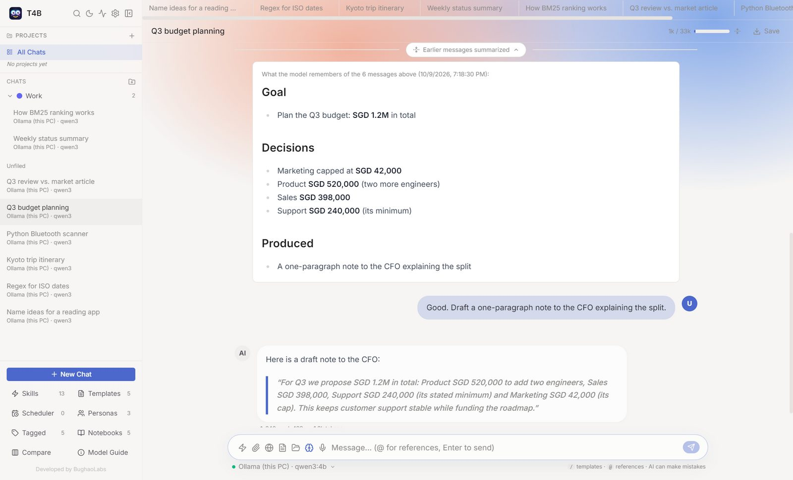

## 5. Everyday features

- **Attach documents.** Drop in PDFs (including scanned ones), Word, Excel, PowerPoint, Outlook `.msg` and `.eml` emails, EPUB, HTML, text and code. T4B extracts the text and sends it with your question.
- **Notebooks** (sidebar → Notebooks). Collections of your documents. Ask questions and get answers grounded only in those documents, with the sources named. Add files, whole folders or web pages. Turn on **Full documents** for small notebooks so the model reads everything. Notebooks open as tiles showing each notebook's sources, anything still processing or failed, and when it was last updated; click a tile to open it, and the back arrow returns to the tiles. Long notebook chats are summarized the same way as other [long chats](#long-chats).

  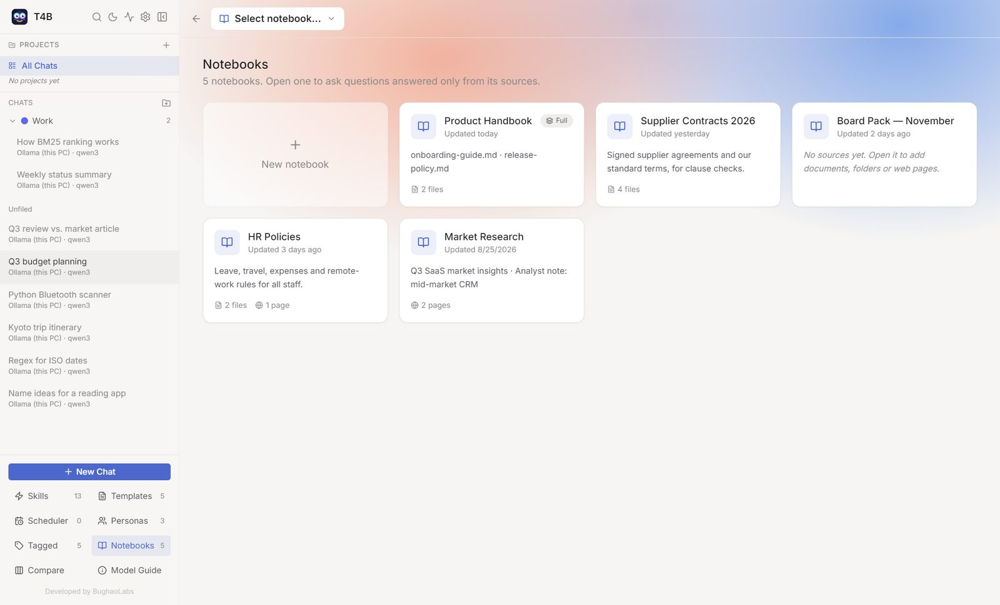

  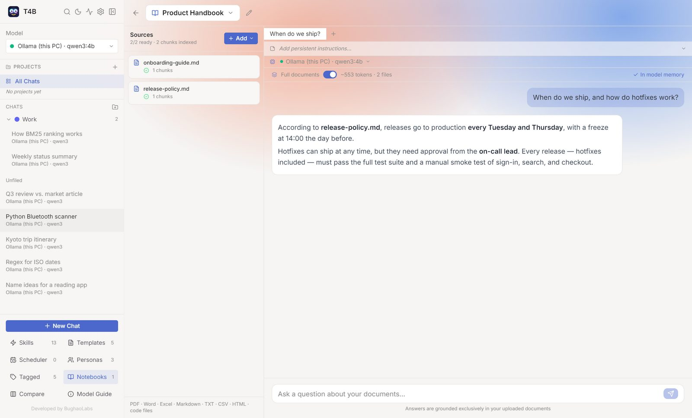

- **Personas** (sidebar → Personas). Saved assistants with their own instructions, model, tools and notebook. For example, *Contract Reviewer* using a local model and your legal notebook.
- **Compare** (sidebar → Compare). Send one prompt to two or three models side by side and compare their answers, speed and cost.

  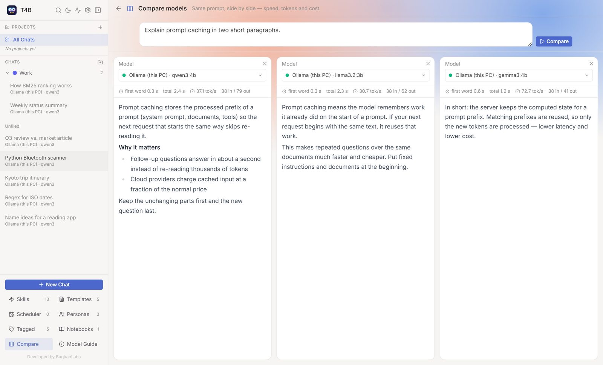

- **Tagged replies.** Bookmark useful answers with colour tags, then find them again in **Tagged**.
- **Scheduler.** Run a prompt automatically, for example every Monday at 8:00. It can send results to a webhook, and it can produce a *notebook digest* that answers a question from a notebook on a schedule.
- **Quick ask.** Press **Ctrl+Shift+Space** anywhere to ask a question without switching apps. The answer opens as a new chat.
- **Code panel.** Click **Open in panel** on any code block to edit it, preview HTML, or save it to your project.
- **Projects.** Group chats by project. Project chats are saved as files inside the project's folder.
- **Status** (pulse icon in the sidebar header). See which model servers are running, what's loaded on your GPU, MCP server health, and this month's spending against your budget.

  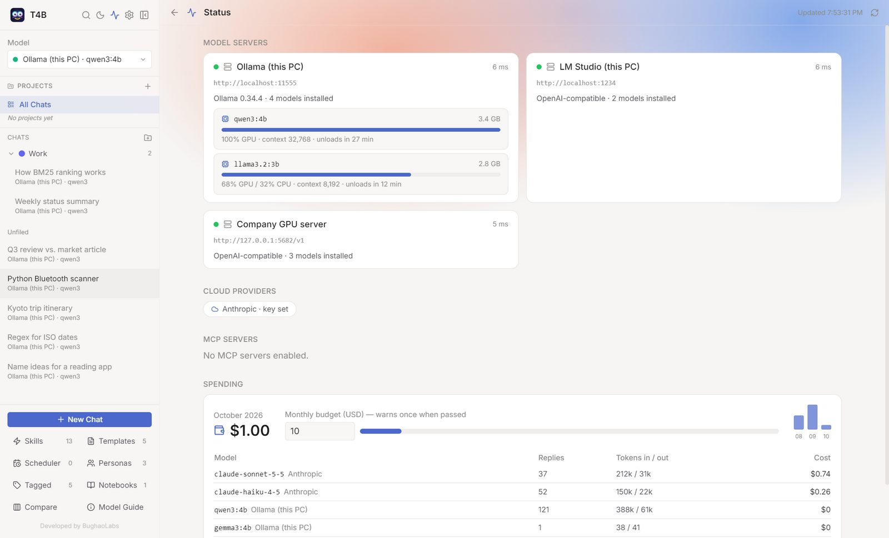

| Personas | Tagged replies | Code panel |
|---|---|---|
| 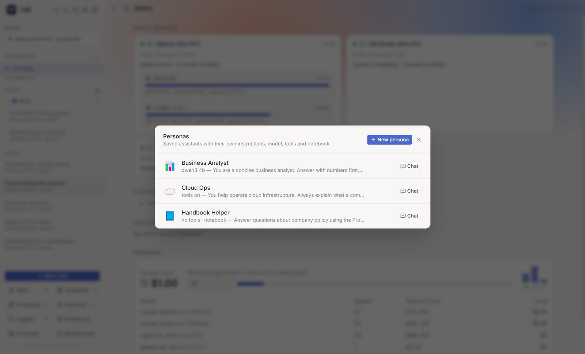 | 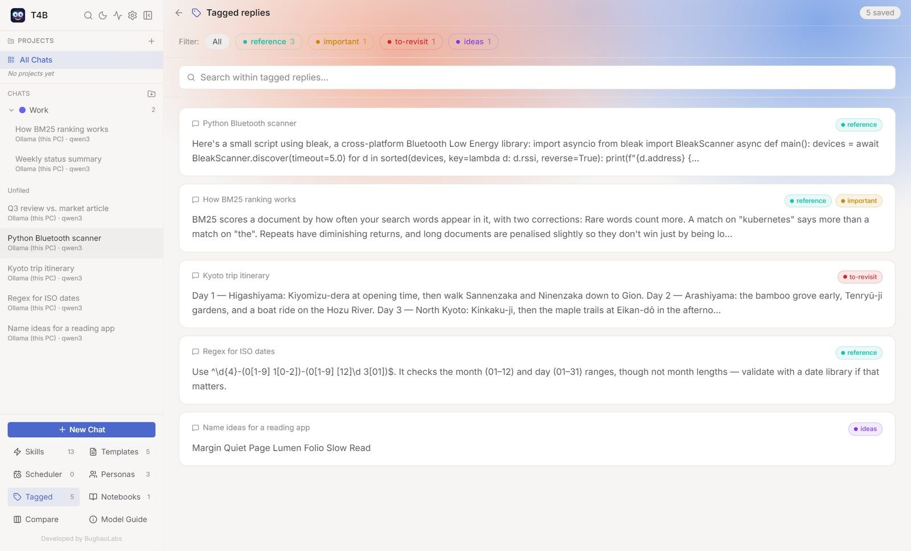 | 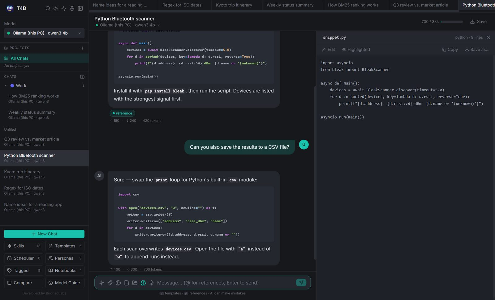 |

## 6. Tools: what T4B can do for you

T4B's tools let the model act, not just talk. Each tool is only offered when your message calls for it, so normal chats stay fast. You can switch tools on or off in **Settings → Tools**.

| Ask something like… | Tool used |
|---|---|
| "What's the latest on the EU AI Act?" | **Web search**, then **Read web pages**. Set up the search service first in Settings → Tools |
| "Summarise https://…" | **Read web pages** |
| "Find the invoice that mentions PO-4471" (folder granted) | **Search files** |
| "Total sales by region in sales.xlsx" | **Analyse spreadsheets** (exact SQL, no guessing) |
| "Turn this into a Word document called Q3 summary.docx" | **Create documents** (Word, PDF, Excel, HTML) |
| "What does our travel policy say about per diems?" | **Search notebooks** |
| "List my EC2 instances", "Show pods in prod" | **Run commands** (aws, kubectl, git, docker…) |
| "Get my open issues from the GitHub API" | **Call APIs**. Save the API key in Settings → Tools |
| "What's 7.5% of 1,284,000?", "Convert 30 °C to °F" | **Calculator** |
| "How many working days until 31 December?" | **Date & time** |
| "Remember that our fiscal year starts in April" | **Memory** |

You can also connect **MCP servers** (Settings → MCP Servers) for services such as Slack, Jira or databases.

## 7. Safety and privacy

- **Approval before actions.** T4B asks before any tool that could change something: running a command that isn't read-only, sending an API request other than GET, writing a file, or calling an MCP tool that makes changes. Change this in **Settings → General → Tool approval**.

  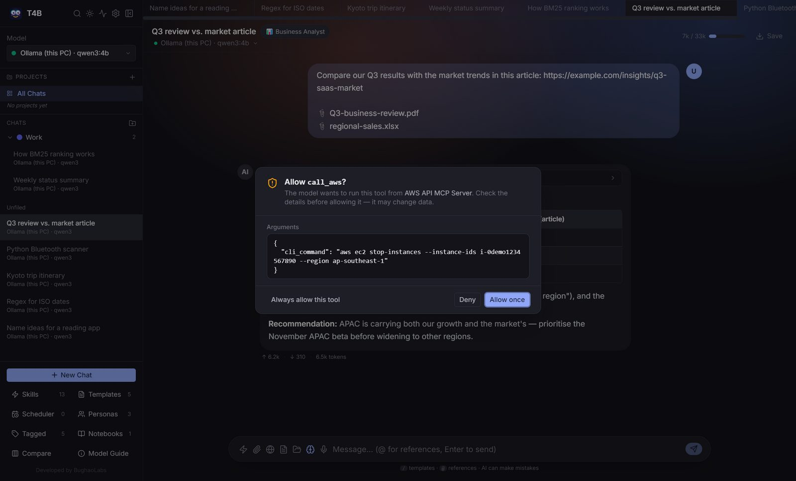

- **Leak protection.** Web pages, files and command output can hide instructions aimed at the AI. Once a reply has read such content, T4B won't let the model send newly composed data anywhere (links, searches, commands, API calls) without asking you first. Keep this on in **Settings → Tools**.
- **Safe links and images.** Links in replies open in your normal browser, never inside T4B, and images from remote servers in replies are not loaded.
- **Your data stays on your computer.** Chats, notebooks and memories are stored in T4B's data folder (`%APPDATA%\airo` on Windows), and API keys are encrypted with your operating system's own protection. Back up that folder to keep a copy (**Settings → General → Your data**).
- **What leaves your computer.** Your messages and attachments go to the model provider you chose. With a local model, nothing leaves your computer except the web searches and pages you ask for.

## 8. Settings at a glance

| Tab | What's there |
|---|---|
| Connections | Add, test, edit, reorder, switch off or remove connections; find local servers; import/export without keys |
| MCP Servers | Connect external tools |
| Tools | Built-in tool switches, leak protection, web search service, API keys for API calls, memories |
| Appearance | Aurora or Graphite Teal style; light, dark or system mode; density |
| General | Tool approval, long chats (automatic summaries), voice input, notebook search, OCR languages, quick-ask shortcut, data folder, updates |

| Aurora light (default) | Aurora dark | Graphite Teal dark |
|---|---|---|
| 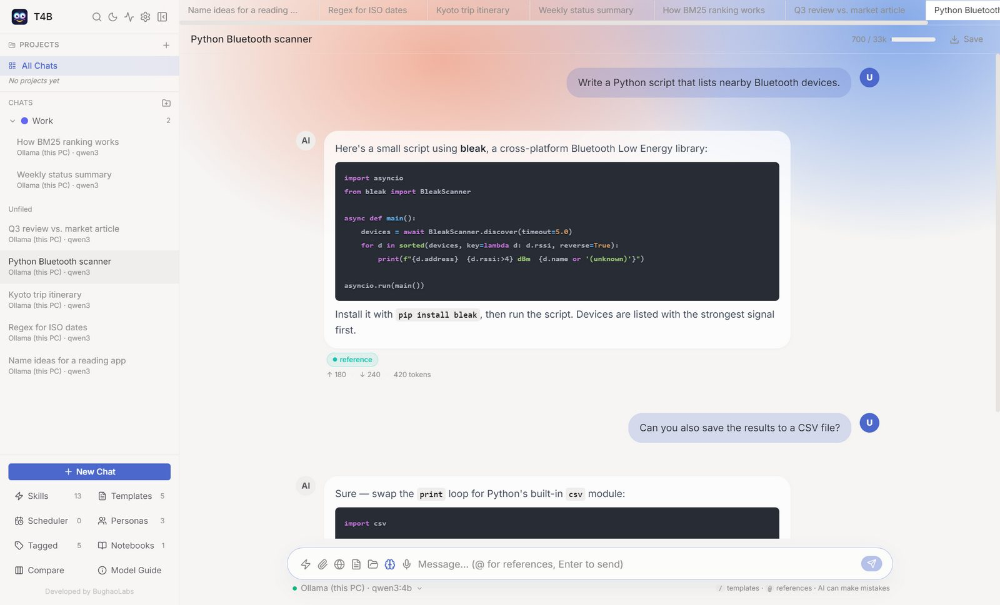 | 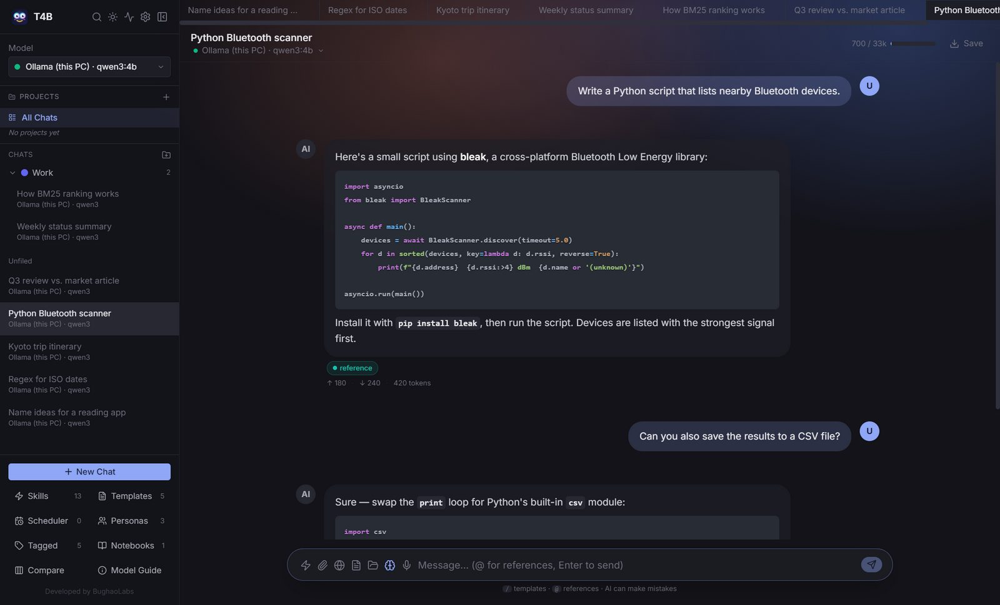 | 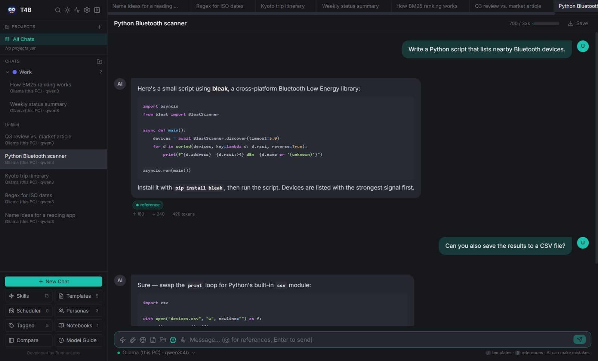 |

| Appearance | General |
|---|---|
| 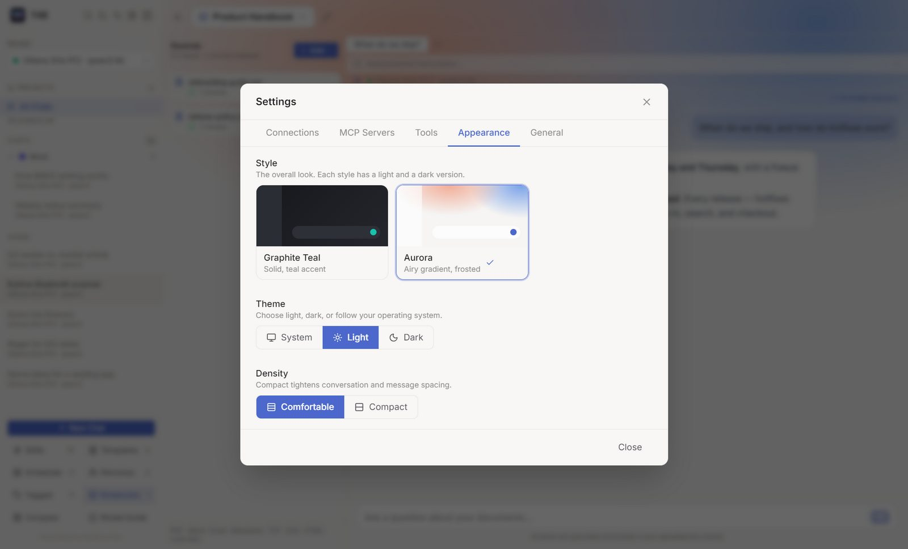 | 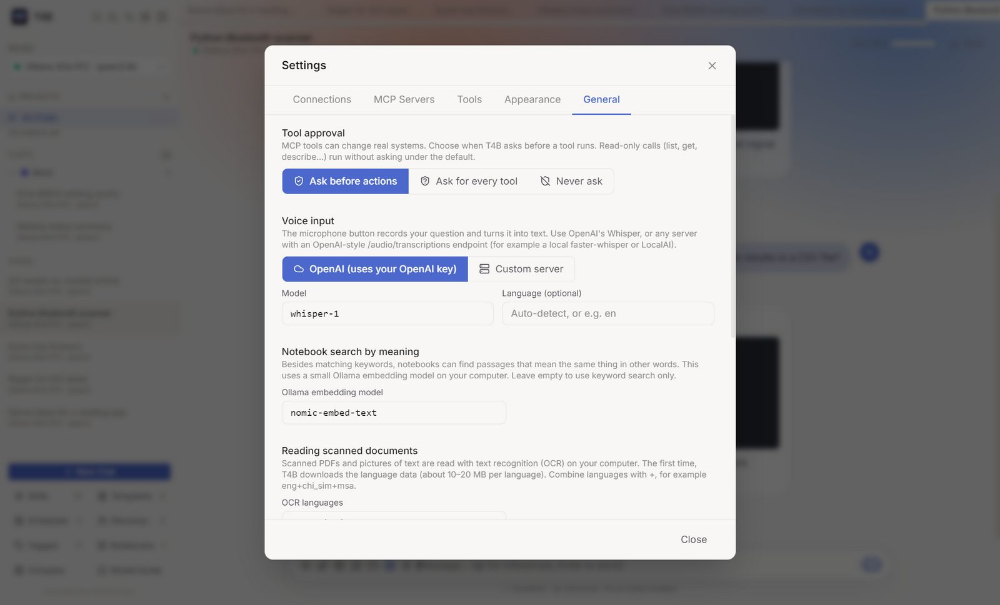 |

## 9. Troubleshooting

| Problem | Try this |
|---|---|
| "No models found" | Check that Ollama (or your server) is running, then open the model picker under the chat box and click the refresh icon next to the connection. Check **Status** to see which servers respond |
| Local model is slow | Pick a smaller model, turn off 🧠 thinking, and check **Status** to see whether the model is on the GPU or the CPU |
| The model doesn't use a tool | Small models sometimes ignore tools. Try a larger model, set 🔧 to **On**, or name the tool ("search the web for…") |
| Web search says "no service is set up" | Choose Brave, Tavily or SearXNG in **Settings → Tools** and click **Test** |
| Scanned PDF comes out empty | The first OCR run downloads language data, so make sure you're online. Add languages in Settings → General → Reading scanned documents |
| The model forgot something from early in a long chat | Click **Earlier messages summarized** to see what it remembers, and restate anything missing. Make sure **Settings → General → Long chats** is on |
| Quick ask shortcut doesn't work | Another app may be using it. Pick another shortcut in Settings → General |
| "Windows protected your PC" when installing | The installer isn't signed yet. Use **More info → Run anyway**, but only for an installer from a trusted source |

---

# Part 2 — 20 ways teams use T4B

Each use case lists the T4B features it relies on and a prompt you can adapt.

> **Confidential data:** for anything sensitive, such as payroll, contracts, customer records or source code, use a **local model** (Ollama) or your **company server**, so the content never leaves your network.

| # | Department | Use case |
|---|---|---|
| 1 | Finance | [Month-end variance commentary](#1-finance--month-end-variance-commentary) |
| 2 | Finance | [Invoice and receipt lookup](#2-finance--invoice-and-receipt-lookup) |
| 3 | Sales | [Account research before a meeting](#3-sales--account-research-before-a-meeting) |
| 4 | Sales | [Proposal and RFP drafting](#4-sales--proposal-and-rfp-drafting) |
| 5 | Marketing | [Competitor and market monitoring](#5-marketing--competitor-and-market-monitoring) |
| 6 | Marketing | [Campaign content in many formats](#6-marketing--campaign-content-in-many-formats) |
| 7 | Human Resources | [Policy assistant for employees](#7-human-resources--policy-assistant-for-employees) |
| 8 | Human Resources | [CV screening against a role](#8-human-resources--cv-screening-against-a-role) |
| 9 | Legal | [Contract review and clause comparison](#9-legal--contract-review-and-clause-comparison) |
| 10 | Compliance & Risk | [Regulation tracking and gap checks](#10-compliance--risk--regulation-tracking-and-gap-checks) |
| 11 | IT Operations | [Cloud and cluster health checks](#11-it-operations--cloud-and-cluster-health-checks) |
| 12 | IT Service Desk | [Troubleshooting from tickets and logs](#12-it-service-desk--troubleshooting-from-tickets-and-logs) |
| 13 | Software Engineering | [Code review, explanation and docs](#13-software-engineering--code-review-explanation-and-docs) |
| 14 | Customer Support | [Answer drafting from the knowledge base](#14-customer-support--answer-drafting-from-the-knowledge-base) |
| 15 | Customer Support | [Complaint and feedback analysis](#15-customer-support--complaint-and-feedback-analysis) |
| 16 | Operations & Supply Chain | [Supplier and inventory analysis](#16-operations--supply-chain--supplier-and-inventory-analysis) |
| 17 | Procurement | [Vendor quote comparison](#17-procurement--vendor-quote-comparison) |
| 18 | Executive Office | [Weekly briefing pack](#18-executive-office--weekly-briefing-pack) |
| 19 | Data & Analytics | [Ad-hoc questions over exports](#19-data--analytics--ad-hoc-questions-over-exports) |
| 20 | Project Management | [Meeting notes to action plan](#20-project-management--meeting-notes-to-action-plan) |

The screenshot at the top of this page shows the pattern behind many of these: a persona (*Business Analyst*) reads an attached PDF, a spreadsheet and a web article, then answers with a sourced table and a recommendation.

### 1. Finance — Month-end variance commentary
Explain why actuals differ from budget without retyping numbers into a chat.
- **Uses:** granted folder, **Analyse spreadsheets** (exact SQL totals), **Create documents**
- **Try:** *"In budget-vs-actual-sept.xlsx, list the 5 cost centres with the largest variance in SGD and %, then write a one-paragraph commentary for each and save it as Sept variance.docx."*
- **Why T4B:** the totals are calculated, not estimated by the model, and the output is a ready-to-edit Word file.

### 2. Finance — Invoice and receipt lookup
Find documents in shared folders by what's inside them, including scanned PDFs.
- **Uses:** **Search files** (searches inside PDF and Office files), OCR for scans, **Read file**
- **Try:** *"Find every invoice in this folder that mentions PO-4471, and give me the invoice number, date and total for each."*

### 3. Sales — Account research before a meeting
Build a one-page brief on a prospect in minutes.
- **Uses:** **Web search** and **Read web pages**, a *Sales Researcher* persona, **Create documents**
- **Try:** *"Research Acme Logistics: what they do, recent news from the last 3 months, leadership, and likely priorities. Cite sources. Save as Acme brief.pdf."*

### 4. Sales — Proposal and RFP drafting
Answer RFP questions consistently, drawing on past winning proposals.
- **Uses:** a **Notebook** of past proposals and product sheets, **Search notebooks**, prompt templates
- **Try:** *"Using the Proposals notebook, draft answers to the 12 security questions in this attached RFP (rfp.docx). Mark any answer you're unsure of."*

### 5. Marketing — Competitor and market monitoring
Keep a weekly pulse on competitors without manual browsing.
- **Uses:** **Scheduler** (weekly), **Web search**, webhook to a Teams or Slack channel
- **Try (scheduled every Monday 8:00):** *"Search for news and product announcements from CompetitorA, CompetitorB and CompetitorC in the last 7 days. Summarise each in 2 bullets with links."*

### 6. Marketing — Campaign content in many formats
Turn one brief into on-brand copy for every channel.
- **Uses:** Skills (*Rewrite*, *Shorten*), a *Brand Voice* persona with your style guide, **Compare** to pick the best model's copy
- **Try:** *"From this launch brief, write a LinkedIn post, a 50-word email teaser, three ad headlines (max 30 characters) and a press-release opening paragraph."*

### 7. Human Resources — Policy assistant for employees
Give staff instant, sourced answers about handbook policies.
- **Uses:** a **Notebook** of the employee handbook (full-document mode), an *HR Helper* persona, a local model
- **Try:** *"How many days of parental leave do we offer, and how do I apply?"* The answer cites the policy file it came from.

### 8. Human Resources — CV screening against a role
Shortlist candidates consistently and fairly against stated criteria.
- **Uses:** granted folder of CVs (PDF/Word), **Search files**, **Analyse spreadsheets** for scoring sheets, a local model for privacy
- **Try:** *"For each CV in this folder, score 1–5 against the 6 must-have criteria in job-spec.docx, with one line of evidence per score. Output a table."*
- **Note:** use this to support decisions, not to make them; a person should review every shortlist.

### 9. Legal — Contract review and clause comparison
Spot risky or non-standard clauses quickly.
- **Uses:** attachments (Word and PDF), a *Contract Reviewer* persona with your playbook in a notebook, a local model
- **Try:** *"Compare the attached supplier agreement with our standard terms in the Legal Playbook notebook. List every deviation in liability, termination, data protection and payment terms, with clause numbers."*

### 10. Compliance & Risk — Regulation tracking and gap checks
Understand new rules and check them against internal policy.
- **Uses:** **Read web pages** on the official text, **Search notebooks** over your policies, **Create documents**
- **Try:** *"Read https://… (the regulator's guidance). Then check our Data Policy notebook and list requirements we don't clearly cover yet. Save as gap-analysis.docx."*

### 11. IT Operations — Cloud and cluster health checks
Ask questions about AWS and Kubernetes in plain English, without a separate MCP server.
- **Uses:** **Run commands** (`aws`, `kubectl`). Read-only commands run straight away; anything that changes something asks first
- **Try:** *"List EC2 instances in ap-southeast-1 that are stopped, and show pods in the prod namespace that aren't Running, with their last 20 log lines."*

### 12. IT Service Desk — Troubleshooting from tickets and logs
Diagnose recurring issues faster.
- **Uses:** attachments (log files, ticket exports), **Analyse spreadsheets** for ticket CSVs, **Run commands** for local checks (`ipconfig`, `Test-NetConnection`)
- **Try:** *"From tickets-q3.csv, which 5 issue categories grew the most month over month? For the top one, suggest a knowledge-base article outline."*

### 13. Software Engineering — Code review, explanation and docs
Understand unfamiliar code and keep documentation current.
- **Uses:** granted project folder, **Search files**, **Read file**, **Write file**, Code panel, `git` through **Run commands**
- **Try:** *"Explain how authentication works in this repo, then draft a README section describing it. Show me the diff before writing."*

### 14. Customer Support — Answer drafting from the knowledge base
Give agents accurate draft replies in seconds.
- **Uses:** a **Notebook** of help-centre articles, a *Support Agent* persona, **Quick ask** (Ctrl+Shift+Space) from any app
- **Try:** paste a customer email and ask *"Draft a friendly reply using only our help articles; include the article links."*

### 15. Customer Support — Complaint and feedback analysis
Turn survey and review exports into themes and actions.
- **Uses:** **Analyse spreadsheets** for counts and trends, summarisation, **Create documents** (Excel or Word)
- **Try:** *"In feedback-sept.xlsx, group the comments into themes, count each theme, give 2 example quotes per theme, and save the table as themes.xlsx."*

### 16. Operations & Supply Chain — Supplier and inventory analysis
Catch stock-out risks and late suppliers early.
- **Uses:** **Analyse spreadsheets** (joins across sheets), **Calculator**, **Date & time**
- **Try:** *"Using inventory.xlsx, list SKUs whose stock will run out before the supplier's next delivery date at the current daily usage. Show the days of cover for each."*

### 17. Procurement — Vendor quote comparison
Compare quotes like-for-like and justify a recommendation.
- **Uses:** attachments (several PDF quotes), **Calculator** for exact totals, **Create documents**
- **Try:** *"Compare these 3 attached quotes on unit price, total cost over 3 years, delivery time, warranty and payment terms. Recommend one and explain why, as a one-page Word memo."*

### 18. Executive Office — Weekly briefing pack
Prepare a concise leadership briefing from many sources.
- **Uses:** **Scheduler**, **Web search** (industry news), **Search notebooks** (internal updates), **Create documents** (PDF)
- **Try:** *"Create this week's briefing: top 5 industry news items with links, key internal updates from the Weekly Reports notebook, and 3 decisions needed. Save as briefing-week-41.pdf."*

### 19. Data & Analytics — Ad-hoc questions over exports
Answer quick business questions without opening a BI tool.
- **Uses:** **Analyse spreadsheets** (SQL over CSV and Excel), **Call APIs** for internal REST endpoints (keys saved in Settings), **Create documents** to share the result
- **Try:** *"In orders-2026.csv, what's the average order value by region and month? Flag any month that's more than 20% below the region's average."*

### 20. Project Management — Meeting notes to action plan
Never lose an action item again.
- **Uses:** voice input or pasted notes, **Memory** (team conventions), **Create documents**, **Call APIs** to post tasks to your tracker (with approval)
- **Try:** *"From these notes, list decisions, action items with owner and due date, and open risks. Save as an Excel tracker, then create the action items in Jira through its API."* T4B asks before sending each request.

---

## Rolling T4B out across a company

- Create a **persona** per team, with the right model, tools and notebook, so people start from a good setup.
- Keep **tool approval** on its default (*Ask before actions*) and **leak protection** on.
- Set a **monthly budget** under **Status → Spending** to track cloud costs.
- Prefer **local or company-hosted models** for regulated or confidential work.
- Set up company connections once and share them with **Export (without keys)**.
